# 打开和关闭文件

`help(open)`获取python内部的帮助

`f = open('./hello.py')`使用open打开文件，返回值是一个file-like对象

`f.read()`读取文件

`f.close()`close方法关闭文件

# 文件对象的操作

* 读
* 写

文件的操作和文件打开方式强相关

## 文件打开方式和文件操作的相关性

Character Meaning
* 'r'       open for reading (default)
* 'w'       open for writing, **truncating the file first**
* 'x'       create a new file and open it for writing
* 'a'       open for writing, appending to the end of the file if it exists
* 'b'       binary mode
* 't'       text mode (default)
* '+'       open a disk file for updating (reading and writing)
* 'U'       universal newline mode (deprecated)

## 以mode=r打开文件

```python
f = open('./hello.py', mode='r')
f.write('test') # mode=r 不可写
f.read() # mode=r 可读
f = open('./not_exist.txt', mode='r') # mode=r 文件不存在时， 会抛出FileNotFoundError
%cat hello.py # 使用bash的命令查看hello.py文件，jupyter需运行在Linux中
```

## 以mode=w打开文件

```python
f = open('./hello.py', mode='w')
f.read() # mode=w  不可读
f.write('abcd') # mode=w 可写
f.close()
%cat hello.py # mode=w 会清空原文件
f = open('./hello.py', mode='w') # mode=w 即使打开后，不做任何操作，也会清空文件
f.close()
f = open('./not_exist.txt', mode='w') # mode=w 当文件不存在时，会创建新文件
f.close()
%ls ./not_exist.txt
```

重点是以mode=w打开文件之后，首先清除源文件内容

## 以mode=x打开文件

```python
f = open('./hello.py', mode='x') # mode=x 当文件存在， 会抛出异常 FileExistsError
%rm ./not_exist.txt # 使用bash删除not_exist.txt文件
f = open('./not_exist.txt', mode='x') # mode=x 总是创建新文件
f.read() # mode=x 不可读
f.write('abcd') # mode=x 可写
f.close()
%cat not_exist.txt # 查看文件内容
```

## 以mode=a打卡文件

```python
f = open('./hello.py', mode='a')
f.read() # mode=a 不可读
f.write('abcd') # mode=a 可写
f.close()
%cat hello.py # mode=a 写入的内容追加到文档末尾
%rm not_exist.txt # 删除not_exist.txt文件
f = open('./not_exist.txt', mode='a') # 以mode=a打开一个不存在的文件，会创建文件
f.write('abcd')
f.close()
%cat not_exist.txt
```

## 控制读写的模式(总结)

* r  只读 文件必须存在
* w  只写，先清空文件， 文件不存会创建文件
* x  只写， 文件必须不存在
* a  只写，追加到文件末尾, 文件不存在会创建

* 从读写的方面来看， 只有r可读不可写， 其他都是可写不可读
* 从文件不存在来看，只有r抛出异常，其他都创建新文件
* 从文件存在来看， 只有x抛出异常
* 从是否影响原始内容来看，只有w会清空文件

## import os

`help(os.open)`系统的open函数，比较底层

## 以mode=t打开文件

```python
f = open('./hello.py', mode='rt')
s = f.read() # mode=t 读入的内容是字符串
type(s)
f.close()
```

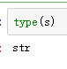

```python
f = open('./hello.py', mode='rb')
s = f.read() # mode=b 读入的是bytes
s
type(s)
f.close()
```

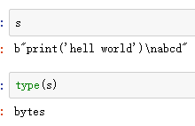

## 以mode=b打开文件

```python
f = open('hello.py', mode='wb')
f.write('马哥教育') # mode=b write参数需为bytes
f.write('马哥教育'.encode()) # 按字节写入， 写入12个字节， 每个中文字符占三个字节
f.close()
```

## 以mode=r+打开文件

```python
f = open('hello.py', mode='r+') #mode=r+ 可读可写
f.read()
f.write('haha')
f.close()
%cat hello.py
```

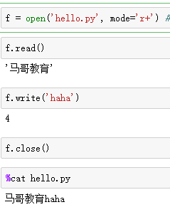

## 以mode=w+打开文件

```python
f = open('hello.py', mode='w+') # mode=w+ 可读可写， 清空文件
f.read()
f.write('haha')
f.close()
%cat hello.py
```
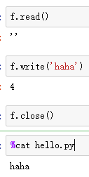

## 以mode=r+打开文件 ***导致的问题***

```python
%cat hello.py
f = open('hello.py', mode='r+') #mode=r+ 可读可写
f.write('he')
f.read()
f.close()
%cat hello.py
```

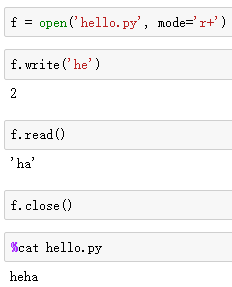

## mode=+总结

当打开文件的时候， 解释器会持有一个指针， 指向文件的某个位置

当我们读写文件的时候，总是从指针处开始向后操作，并且移动指针

当mode=r时， 指针是指向0(文件开始)

mode=a时， 指针指向EOF(文件末尾)

## 以mode=a+打开文件的问题

```python
f = open('hello.py', mode='a+')
f.read()
f.write('heihei')
f.close()
%cat hello.py
```

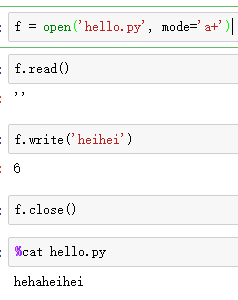

## 以mode=+打开文件 ***导致的问题***

```python
f = open('hello.py', mode='+') # 单独的+不能工作， mode里必须有且仅有rwxa中的一个
```

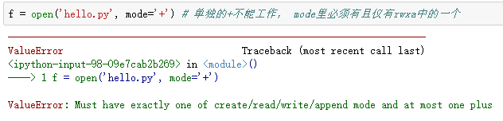

## mode=+总结
当mode包含+时， 会增加额外的读写操作， 也就说原来是只读的，会增加可写的操作， 原来是只写的，会增加可读的操作，但是+不改变其他行为

## 指针的位置

```python
f = open('hello.py') # 打开文件默认使用rt模式打开
f.tell() # 获取当当前文件指针的位置
f.read()
f.tell()
f.close()
```

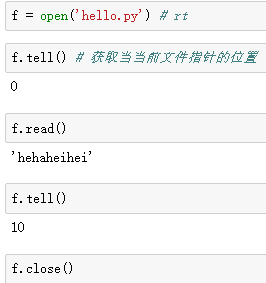

### seek指针的使用
`help(f.seek)`获取跳转指针的位置的帮助

seek(cookie, whence=0, /) method of io.TextIOWrapper instance
    Change stream position.

* 0 -- start of stream (the default); offset should be zero or positive
* 1 -- current stream position; offset may be negative
* 2 -- end of stream; offset is usually negative


    按字节移动文件指针
    当whence为start(0)(默认值)， offset可以是任意整数
    当whence为current(1)或者end(2)， offset只能为0

```python
f.seek(2) # 指针跳到文件第3个字符
f.seek(2,0) # 和上面的命令的含义一样
f.seek(0, 0) # 把指针指向文件第一个字符
f.seek(4, 1) # 不支持
f.seek(4, 2) # 不支持
f.seek(0, 1) # 支持，指针位置不变
f.seek(0, 2) # 支持，跳转尾部
f.close()
```

### mode=b
    按字节移动文件指针
    当whence为start(0)(默认值)， offset可以是任意整数
    当whence为current(1)或者end(2)， offset也可以是任意整数

```python
f = open('hello.py', mode='rb') # rb
f.seek(3) # 按字节操作
f.read().decode()
f.seek(3)
f.seek(3, 1) # whence=current(1) offset可以是任意整数
f.read().decode()
f.seek(3, 2)
f.seek(-3, 2) # whence=end(2) offset可以是任意整数
f.seek(13) # 向后超出范围允许
f.seek(-13, 2) # 向前超出范围不允许
f.close()
```

### 超出范围后写内容

当seek超出文件末尾， 不会有异常， tell也会超出文件末尾， 但是写数据的时候，还是会从文件末尾开始写

```python
f = open('hello.py', mode='a+')
f.seek(0, 1) # 如截图，共十二个字符
f.seek(13) # 指针跳转超出
f.write('abc') # 在指针超出的情况下写文件
f.read()
f.tell() # tell 总是以字节来计算
f.close()
```

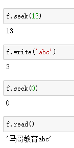

## 指针总结

* 文件指针按字节操作
* tell方法返回当前文件指针位置
* seek方法移动文件指针
* whence 参数 SEEK_SET(0) 从0开始向后移动offset个字节, SEEK_CUR(1) 从当前位置向后移动offset个字节, SEEK_END(2) 从EOF向后移动offset个字节
* offset是整数
* 当mode为t时， whence为SEEK_CUR或者SEEK_END时， offset只能为0
* 文件指针不能为负数
* 读文件的时候从文件指针(pos)开始向后读
* 写文件的时候从min(EOF,pos)处开始向后写
* 以append模式打开的时候，无论文件指针在何处，都从EOF开始写

## 缓冲区

### mode=b模式的时候

```python
f = open('hello.py', 'wb')
f.write(b'abc')
f.flush() # flush方法刷新缓冲区
%cat hello.py
f.write(b'abc')
%cat hello.py
f.close() # close 也会刷新缓冲区
%cat hello.py
```

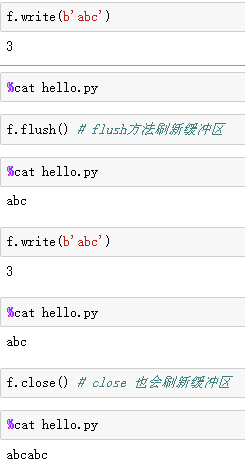

```python
f = open('hello.py', 'wb', buffering=5) # 缓冲区大小设置为5个字节
f.write(b'abc')
%cat hello.py # 文件为空
f.write(b'abc') # 检查缓冲区是否足够写入当前字节，如果不够，flush缓冲区，然后再把当前字节写入缓冲区
%cat hello.py
f.close()
```

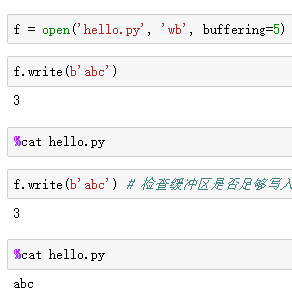

### mode=t模式的时候

buffering=1代表以line buffer模式运行，每遇到换行符flush一次

```python
import io
io.DEFAULT_BUFFER_SIZE 缓存区大小
f = open('hello.py', 'wt', buffering=1) # 文本模式， buffering 为1 使用line buffer
f.write('abc')
%cat hello.py
f.write('\n') # text mode 当写入换行符时，会刷新缓冲区
%cat hello.py
f.close()
```

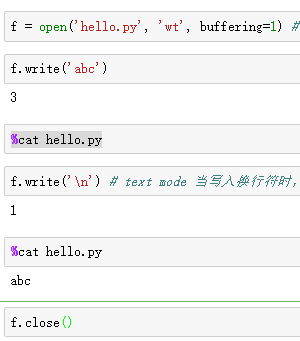

buffering=5，只要buffering大于1，代表开启缓存区而不是指定缓冲区大小

```python
f = open('hello.py', 'wt', buffering=5) # text mode buffering　大于1， 缓冲区大小为io.DEFAULT_BUFFER_SIZE 缓冲区满的时候，flush缓冲区，连同本次写入的内容
f.write('abc')
%cat hello.py
f.write('\n')
%cat hello.py
f.close
```

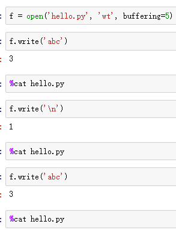

`f = open('hello.py', 'wt', buffering=0)`文本模式不能关闭缓冲区

## buffer总结

buffering=-1
* 二进制模式： DEFAULT_BUFFER_SIZE
* 文本模式: DEFAULT_BUFFER_SIZE
buffering=0
* 二进制模式: unbuffered
* 文本模式： 不允许
buffering=1
* 二进制模式： 1
* 文本模式： line buffering
buffering>1
* 二进制模式：buffering
* 文本模式： DEFAULT_BUFFER_SIZE


二进制模式： 判断缓冲区剩余位置是否足够存放当前字节，如果不能，先flush， 在把当前字节写入缓冲区，如果当前字节大于缓冲区大小， 直接flush

文本模式： line buffering，遇到换行就flush， 非line buffering，如果当前字节加缓冲区中的字节，超出缓冲区大小，直接flush缓冲区和当前字节

特殊文件对象有特殊的刷新方式

flush和close可以强制刷新缓冲区

## IO的一些其它指令

 ```python
 f = open('hello.py','w')
 f.write('abc\nbcd\ncde')
 f.close()
 %cat hello.py
 ```

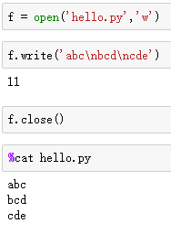

```python
f = open('hello.py')
f.readline() # 按行读
f.readlines() # 每行数据作为一个元素保存到列表中
f.close()
f = open('hello.py', 'r+')
f.readable() # 判断文件是否可读
f.read(2) # 从当前位置开始向后读2个字符
f.read(2)
f.read(-1) # 从当前位置读到最后一个字符
```

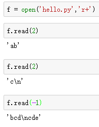

```python
f.seek(0) # 指针挪到第一个字符
f.readline(1) # 读入min(size, EOF-pos)个字符, 如果遇到换行符， 提前返回
f.writelines(['abc\n', 'cbd\n']) # 一次性写入多组文本
```

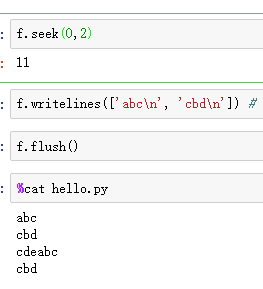

```python
f.seekable() # 文件指针是否可移动
f.fileno() # python程序打开文件的序列号
f.isatty() # 是否是tty文件，tty在linux中是命令行的名称
sys.stderr.isatty() # 是否是tty文件
f.mode # 显示打开文件的模式
f.name # 文件名
f.close()
```

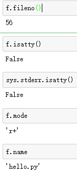

```python
f = open('hello.py', mode='r+b')
f.writelines([b'aaaa\n',b'bbbb\n', b'cccc\n', b'dddd\n', b'abc\n', b'abc\n', b'cbd\n']) # 二进制模式的writelines的使用方法
f.flush()
f.seek(0)
f.readline() # 读一行
f.readlines() # 读全部文件，返回一个列表
f.close()
```

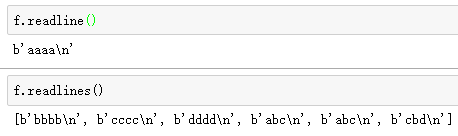

## 文件数量限制

```python
lst = []
for x in range(2000): # 打开2000个文件
    lst.append(open('haha.txt'))
len(lst)
for x in lst: # 关闭已经打开的文件
    x.close()
```

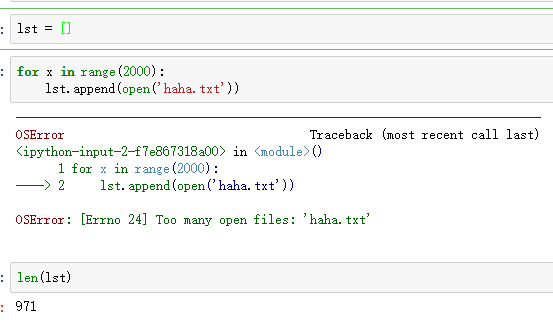

Linux中查看进程文件限制的命令ulimit -a

# 上下文管理

文件关闭，可能会关闭失败比如
```python
f = open('haha.txt')
f.write('12345')
f.close()
f.closed
```

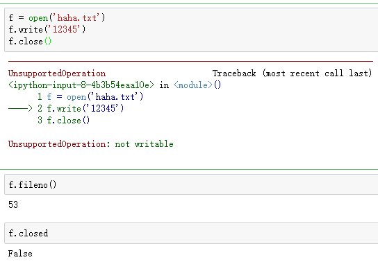

可以使用如下方式关闭文件
```python
f = open('haha.txt')
try:
    f.write('12345')
finally:
    f.close()
f.closed
```

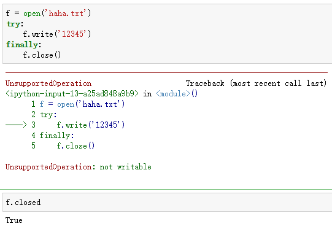

以上都是我们自己解决文件关闭失败的方式，python提供了一个关闭文件的解决方案
```python
with open('haha.txt') as fh:
    pass
fh
fh.closed
```

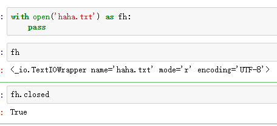

上下文管理，会在离开时自动关闭文件， 但是他不会开启新的作用域

另外一种解决方案
```python
f = open('haha.txt')
with f:
    pass
f.closed
```

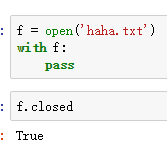

关闭之后的文件，我们还可以执行的命令`f.name`

## StringIO

StringIO称为File-like对象，是内存模拟文件的一种实现

```python
from io import StringIO
sio = StringIO()
sio.readable() # 可读判断
sio.writable() # 可写判断
sio.seekable() # 指针可移动判断
sio.write('abcd') # 写内容到StringIO
sio.seek(0) # 跳转第一个字符
sio.read() # 读StringIO
```

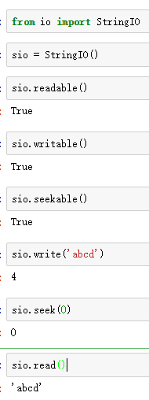

## BytesIO

```python
from io import BytesIO
bio = BytesIO()
bio.write(b'abcd')
bio.seek(0)
bio.read()
bio.getvalue() # getvalue 可以一次性独处全部内容，不管文件指针在哪里
```

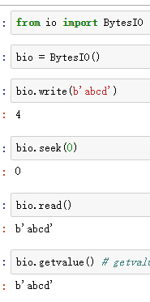

```python
bio = BytesIO()
buf = bio.getbuffer() # 查看缓冲区的内容
bio.close() # 缓冲区使用的情况下，关闭会报错
buf.release() # 关闭缓冲区
bio.close()
```

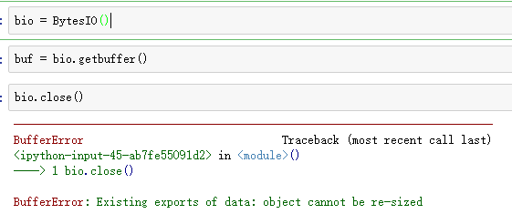

## socket

略，在网络部分会详细讲

# 路径操作

```python
import os # os.path 是以字符串的方式操作路径的
import pathlib # 以OO的方式操作路径
cwd = pathlib.Path('.')
cwd
```

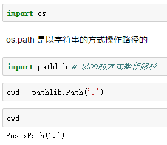

```python
import pathlib
cwd = pathlib.Path('.')
cwd.is_dir()
cwd.iterdir() # 返回的是一个生成器
for f in cwd.iterdir():  # 遍历目录并不会递归遍历
    print(type(f))
    print(f)
```

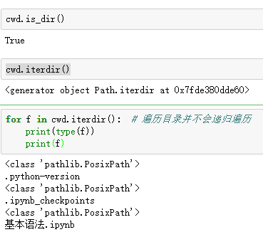

## 创建目录

```python
d = pathlib.Path('./abcd') # 指定要创建目录的名字
d.exists() # 查看目录是否存在
d.mkdir(0o755) # 以755的权限创建文件
%ls -ld ./abcd # 查看文件的创建情况
```

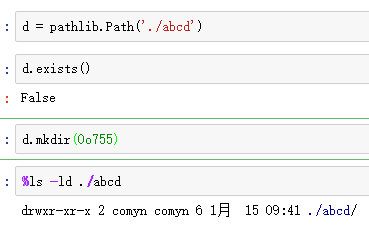

## 在父目录不存在的情况下创建子目录

```python
d = pathlib.Path('./ab/cd/ef')
d.mkdir(parents=True) # 自动创建父目录 -> mkdir -p
d.mkdir(parents=True, exist_ok=True) # mkdir -p
d = pathlib.Path('./abcd/')
d.rmdir()  # 删除必须是空目录
```

## 通用操作

```python
f = pathlib.Path('./ab/cd/a.txt')
f.exists() #判断路径是否存在
f.is_file() # 当路径不存在时 is_* 方法都返回false
f.is_dir() # 判断是否是目录
f.is_absolute() # 判断是否是绝对路径
f.absolute() # 获取绝对路径
f.absolute().as_uri() # 以uri的格式显示绝对路径
f.chmod(0o777) # 更改文件权限为777
f.cwd() # 获取父目录
f.drive # windows 特有，获取盘符
pathlib.Path('~').expanduser() # 把Linux中使用特殊字符表示路径的方式转换为路径
f.home() # 当前文件属主的家目录路径
help(f.lchmod) # 如果一个路径是一个符号链接， 修改符号链接的权限
f.name # basename
f.home().parent # dirname
f.home().parts # 以元组的方式整个路径
f.home().root
f.suffix # 文件后缀名
f.suffixes # 文件有多个后缀名，全部显示
f.stat() # stat，文件属性信息
f.lstat() # 针对符号链接
d = pathlib.Path('/home/ok/workspace')
for x in d.glob('**/*.py'): # 通配符匹配
    print(x)
help(d.rglob) # 拓展通配符匹配
```

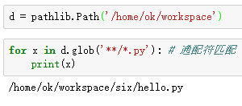

```python
pathlib.Path('/', 'home', 'comyn', 'workspace')
print(pathlib.PureWindowsPath('c:', '/windows', 'system32')) # 连接windows路径的方法
def get_home(user): # 连接字符串生成路径
    return pathlib.Path('/home', user)
get_home('ok')
```

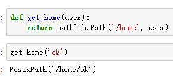

## copy， move， rm

`import shutil`

### 针对文件的操作

* shutil.copyfileobj  # 操作对象是文件对象
* shutil.copyfile     # 仅复制内容
* shutil.copymode     # 仅复制权限
* shutil.copystat     # 仅复制元数据
* shutil.copy         # 复制文件内容和权限  copyfile + copymode
* shutil.copy2        # 复制文件内容和元数据 copyfile + copystat

### 针对目录

shutil.copytree # 递归复制目录， copy_function 参数指定用何种方法复制文件

  * shutil.rmtree # 用于递归删除目录， ignore_errors 表示是否忽略错误， onerror 参数表示如何处理错误， 仅当ignore_errors 为False时， onerror才生效, ignore_errors 为True是遇到错误直接抛出异常

shutil.move # 具体实现依赖操作系统， 如果操作系统实现了 rename系统调用， 直接走rename系统调用，如果没实现，先使用copytree复制， 然后使用rmtree删除源文件

# 序列化和反序列化

* 序列化： 对象转化为数据
* 反序列化： 数据转化为对象

当反序列化一个对象时， 必须存在此对象的类

虽然序列化的对象， 但是事实仅仅只是数据被序列化了

## pickle

* 序列化和反序列化针对的是类型和数据
* pickle 是用序列化协议是Python私有协议

### RPC程序案例

服务端
```python
class RPC:
    def __init__(self):
        self.data = []

    def server(self):
        self.data = list(range(10))

    def client(self):
        print(self.data)
s = RPC() # 实例化
s.server() # 服务端执行
s.data
pickle.dumps(s) # 序列化数据
```

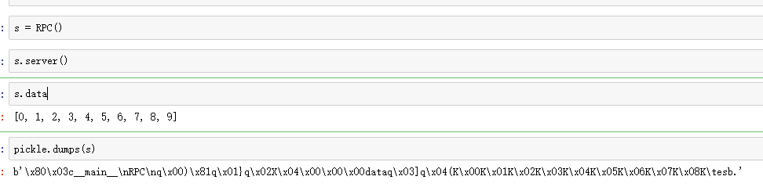

客户端
```python
class RPC:
    def __init__(self):
        self.data = []

    def server(self):
        self.data = list(range(10))

    def client(self):
        print(self.data)
import pickle
s = pickle.loads(b'\x80\x03c__main__\nRPC\nq\x00)\x81q\x01}q\x02X\x04\x00\x00\x00dataq\x03]q\x04(K\x00K\x01K\x02K\x03K\x04K\x05K\x06K\x07K\x08K\tesb.') # 反序列化
s.client()
```

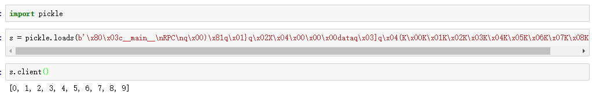

## json

json python数据结构的对应关系

* object dict
* array list
* integer int
* float float
* string str

```python
import json
d = {'a': 1, 'b': [1, 2, 3]}
json.dumps(d)
json.loads('{"a": 1, "b": [1, 2, 3]}')
```

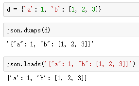

`help(json.loads)` `help(json.load)`深入研究这个两个命令的用法

`json.dumps(d)`只dumps数据还不够，因为json.dumps转换后的数据是字符串，还需要把数据转换为二进制传输`json.dumps(d).encode()`转换为二进制传输是为了防止客户端服务器的编码不一致导致传输的数据后不可用  

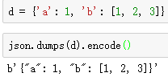

## msgpack

新型序列化传输数据的格式，序列化后的数据是二进制的和json序列化后的字符串

http://msgpack.org/
