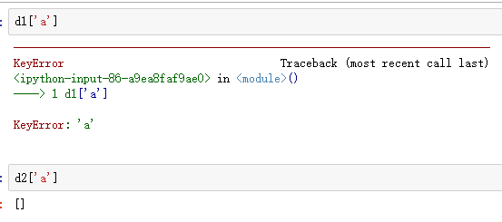

## 字典及其操作

字典在python中的作用是存储键值对的一种数据结构，其中key定义后不可以改变，value可以改变。既然是一个数据结构那么一定逃不掉被操作的命运，字典的操作包括：增，删，改，查。

### 初始化

  既然要操作字典，那么我们需要先定义字典，定义字典的方法有两种：一，直接定义，另一种使用函数把非字典的数据结构转化为字典。

  字典的key可以是字符串，也可以是元组，也可以是bytes。可以总结为key必须是不可变化的数据结构，即可hash的数据结构。

  字典的value没有限制

* 直接定义

  `d = {'a': 1, 'b': 2, 'c': 3}`以字符串为key`d1 = {1:2}`以数字为key`d2 = {(1,2):2}`以元组为key`d2 = {b'abc':2}`以bytes为key

  当以可变数据结构为key时，会抛出NameError

* 使用dict函数

  `d4 = dict([['a',1], ('b',1)])`dict函数可以接受单个或者多个 ***二元组，二元列表*** 组成的列表或元组

  `d4 = dict((['a',1], ('b',1)))`

  `d = dict({'a': 1, 'b': 3})`也可以接受字典作为输入

### 增

  改有两种方法：一，使用‘增’的update；二，使用key

* update

  `d.update([['d', 2], ('b',1)])`字典的update用法和dict函数接受输入的类型同样。当key不存在增key并增加value，key存在则更改

  `d4.update = dict((['a',1], ('b',1)))`

  `d.update({'d': 1, 'e': 2})`也可以接受字典作为输入

* key

  `d['f'] = 123`存在更改，不存在增加

### 改

  改有两种方法：一，使用‘增’的update；二，使用key

*  第一种方法略

* 第二种方法略

* setdefault

  `d.setdefault('c', 'default')`为一个不存在的key设置默认值

***增和改使用的函数和方法基本一致***

### 删

  `d.pop('d')`删除指定key

  `d.popitem()`随机删除一个key

  `d.clear()`清空字典

### 查

  字典存储数据时， ***key是通过hash后，把数据存储对应hash值的列表中***，所以查找时找key的的性能是O(1)的，所以查找value的性能是O(n)。***整体的查询性能接近O(1)***

* 直接通过key访问

  `d['d']`key不存在则报错

* get

  `d.get('f')`key存在则返回value，不存在返回None

  `d.get('c', 'default')`key存在则返回value，不存在返回自定义的default，default也可以更换为其它字符串


### 字典遍历

  `d.keys()`查看全部key，***返回值是一个可迭代对象***

  `d.values()`查看全部value

  `d.items()`字典数据以二元组列表的形式返回

  ***keys， values， items 返回的都类似生成器, 它并不会复制一份内存***

  ***python2返回的是一个list并且有一个返回迭代器的方法，python3若想返回一个list可以是list函数把迭代器转换为list***


### 默认字典

  `from collections import defaultdict`导入默认字典数据结构

  `d1 = {}`初始化一个字典`d2 = defaultdict(list)`初始化一个默认字典

  `d1['a']` `d2['a']`d1,d2都访问一个不存在的key

  

  默认字典执行`d2['a']`会添加一个key其value为None

  

  ***default初始化的时候， 需要传入一个函数， 这个函数也叫工厂函数， 当我们使用下标访问访问一个key的时候， 如果这个key不存在， defaultdict会自动调用初始化时传入的函数， 生成一个对象作为这个key的value***

### 有序字典

  `from collections import OrderedDict`导入有序字典数据结构

  `d = OrderedDict()`有序字典，会保持插入顺序


### 使用list实现dict

  ***这部分内容，不需掌握，主要是帮助理解dict***

  list实现dict有两种方法：一，拉链发，要点是一个hash值为一个链 ***链为list***，每个链存储多个key和value；二，开区间法。这里以拉链法为例

  ```python
  class Dict:
  #初始化一个字典，self代表要初始化的字典名称，num是把key和value存储在多少个链上，即创建多少个链存储key和value
    def __init__(self, num):
        self.__solts__ = []
        self.num = num
        for _ in range(num):
            self.__solts__.append([])

  #向字典中增加元素的方法
    def put(self, key, value):
  #确定key和value存储哪个链上
        i = hash(key) % self.num
        for p, (k, v) in enumerate(self.__solts__[i]):
  #key存在则，跳出循环执行self.__solts__[i][p] = (key, value)，更改key对应的value
            if k == key:
                break
  #key不存在则增加key和value
        else:
            self.__solts__[i].append((key, value))
  #return结束调用，则不会执行self.__solts__[i][p] = (key, value)
            return
        self.__solts__[i][p] = (key, value)

  #获取字典中value的方法
    def get(self, key):
        i = hash(key) % self.num
        for k, v in self.__solts__[i]:
  #key存在返回value
            if k == key:
                return v
  #不存在抛出错
        raise KeyError(key)

  #keys方法，定义ret列表，把key诸葛添加到ret中，然后返回
    def keys(self):
        ret = []
        for solt in self.__solts__:
            for k, _ in solt:
                ret.append(k)
        return ret

    def values(self):
        ret = []
        for solt in self.__solts__:
            for _, v in solt:
                ret.append(v)
        return ret

    def iterms(self):
        ret = ()
        for solt in self.__solts__:
            for k, v in solt:
                ret = (k, v)
  ```
